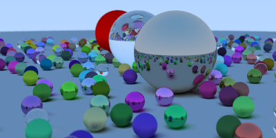

# TL;DR
During a few days off I wrote a small raytracer with the wonderful book
[Ray Tracing in One Weekend](https://raytracing.github.io/books/RayTracingInOneWeekend.html) using Go.



I am quite happy with the results and can only recommend
the book if you are interested in image synthesis and shiny spheres.

# Motivation
During my Bachelors degree a Computer Graphics course was mandatory
and one assignment was to write a Ray Tracer in Python.
It was an interesting and challenging task, which at the time I was unable to complete. 
I implemented the ray tracer to fit the requirements for a passing grade and 
continued with other assignments.

This did not sit right with me since.

So, with some time on my hands, I decided to try again with Go as my language
of choice. The book [Ray Tracing in One Weekend](https://raytracing.github.io/books/RayTracingInOneWeekend.html) takes you by the hand and illustrates
the neccessary math with code examples in C++.

I am in no way a geometry guru and still was able to produce decent results , which should encourage everyone thinking about trying the book.

And with this new ray tracer my confidence is through the roof, people are nicer
to me and my hair looks amazing. 

# Running
```bash
make image
```
Creates an image *scene.png* with the width and height provided
in the Makefile.

```bash
go run main.go image 800 600
```
Creates an image with a width of 800 pixels and a height of 600 pixels.

# Open Tasks
* Disconnect progress bar from rendering so both can be run in a go-routine
* Improve performance by rendering in multiple go-routines
* Checkout the rest of the [series](https://raytracing.github.io/) 

# License
WTFPL license <br>
<a href="http://www.wtfpl.net/"></a>